# Battleship
## Overview
Welcome to Battleship!
This is a adaptation of the naval strategy game, playable directly in the terminal. Engage in a tactical battle against a computer opponent, strategically deploying your fleet and hunting down enemy vessels. The game features a clean, text-based interface with colored output for an enhanced user experience.

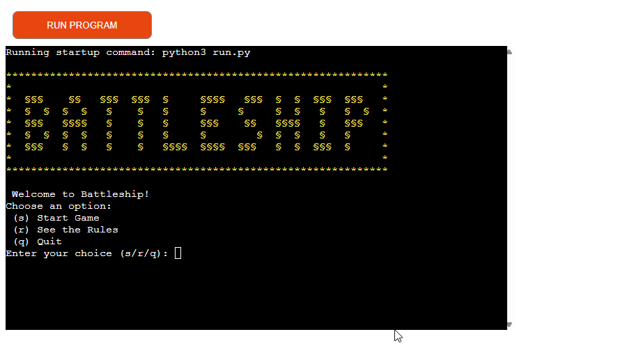

Link to Heroku: [Battleship](https://msp3-battleship-a0f0482c2f33.herokuapp.com/)

## Table of contents:
1. [**Overview**](#overview)
2. [**Planning stage**](#planning-stage)
    * [***Target Audiences***](#target-audiences)
    * [***User Stories***](#user-stories)
    * [***How This will Be Accomplised***](#how-this-will-be-accomplished)
3. [**Features**](#features)
    * [***Welcome Screen***](#welcome-screen)
    * [***Rules***](#rules)
    * [***Gameplay***](#gameplay)
    * [***Game Over***](#game-over)
4. [**Future Improvements**](#future-improvements)
5. [**Testing Phase**](#testing-phase)
6. [**Libraries**](#libraries)
7. [**Deployment**](#deployment)
8. [**Credtis**](#credits)

***
## **Planning stage**

### **Target Audiences**
* Users who enjoy classic strategy board games.
* Users looking for a simple, text-based game to play in a terminal environment.
* Individuals interested in a demonstration of object-oriented programming principles in Python applied to game development.
* Casual gamers seeking a quick and engaging single-player experience.

### **User Stories**
* As a user, i want to start a new game of Battleship against the computer.
* As a user, i want to be able to view the game rules before play.
* As a user, i want to enter my name for a personalized experience.
* As a user, i want to choose to place my ships manually or have them placed randomly.
* As a user, i want to receive clear feedback on what is happening at every stage of the game.
* As a user, i just want to have a good time with Battleships!

### **How This Will Be Accomplished**
* This game is implemented entirely in Python, utilizing an object-oriented programming (OOP) paradigm.
* All interactions and game display occur within the command-line terminal.
* Users can choose to either start the game immediately or read the rules first.
* After selecting 'Start', the user can enter their name.
* Users can either place their ships on the board themselves or choose to have them distributed randomly.
* Users receive clear visual feedback at every stage of the game.
* If the user makes an input that is not intended, he receives clear feedback and can repeat the input.

***
## **Features**

### **Welcome Screen**
* Users are greeted with the start screen.
* From here, they can:
    * Start the game
    * Read the rules
    * Exit the game

### **Rules**
* Here, the user is given an overview of the rules.
* Once they have finished reading, users can return to the start screen by pressing any button.

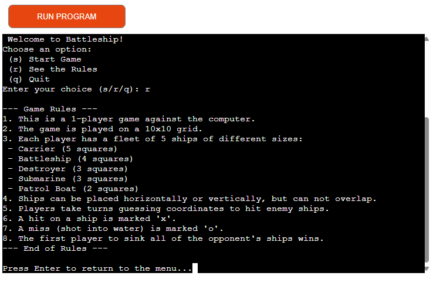

### **Gameplay**
* When the game starts, users are asked to enter their name.

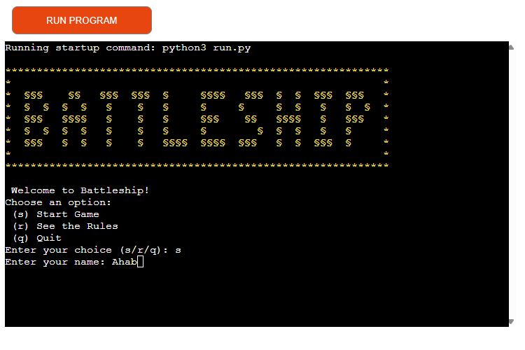

* Users are then given the option to either place the ships manually or leave it to chance.

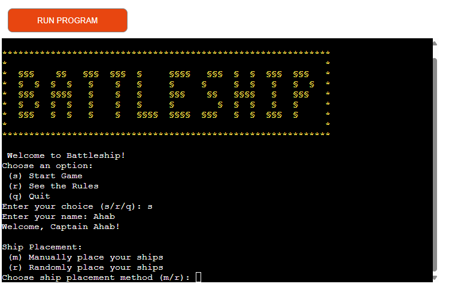

* If the user chooses manual placement, they can place the ships on the playing field one by one and in any order.

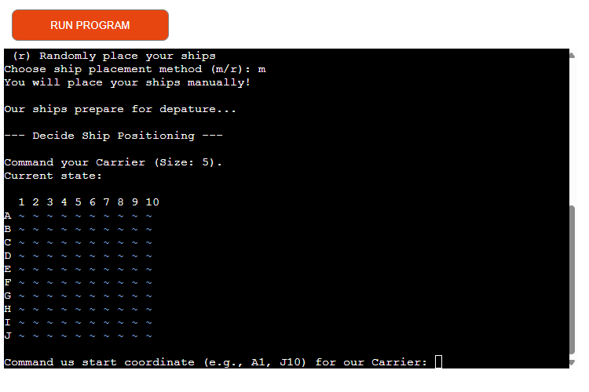

* Once the orientation has been selected (horizontal or vertical), the ship is placed according to the users choice.

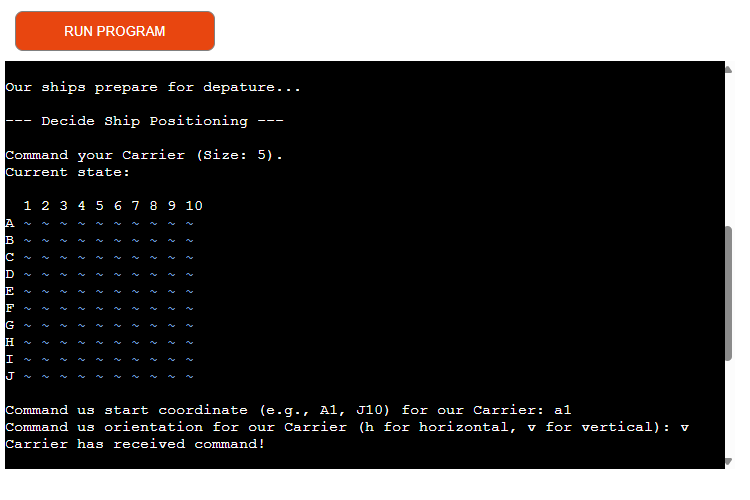

* If a users makes an invalid entry — for example, by trying to leave the grid or put a second boat on the same field — they will see a relevant error message.

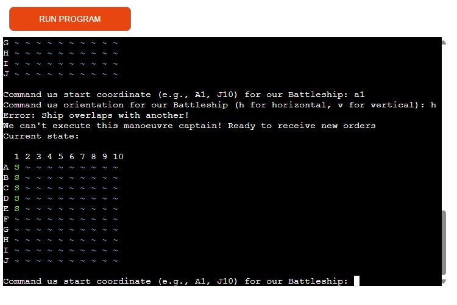

* Once the user has placed all their ships or selected random placement, their nautical chart will be displayed.
    * The symbol "~" represents unexplored water, while "S" represents the user's own ships.
    * "~" is displayed in the colour blue.
    * "S" ist displayed in the colour green.

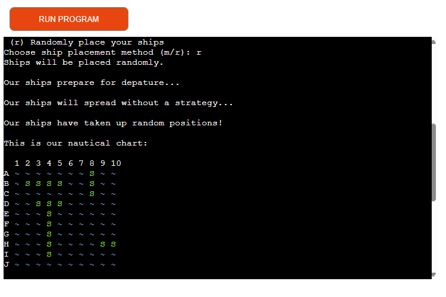

* The computer then places its ships randomly on its map, after which the first turn begins.
* The two important cards for users are displayed side by side here.
    * To the left, the user can see their own ships and the fields shot at by the computer.
    * On the right-hand side, the user must reveal the map by firing at individual squares.
* The user is then prompted to select a coordinate on the map.

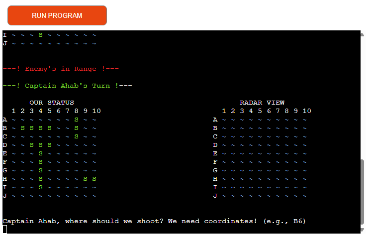

* After entering their desired coordinates, the user's attack runs first, followed by the computer's.
* It is clearly displayed whether the player has hit or missed, the same applies to the computer's turn.
* The symbol "o" means that no target was hit (only water).
    * This symbol is displayed in the colour cyan, as an additional colour indication.

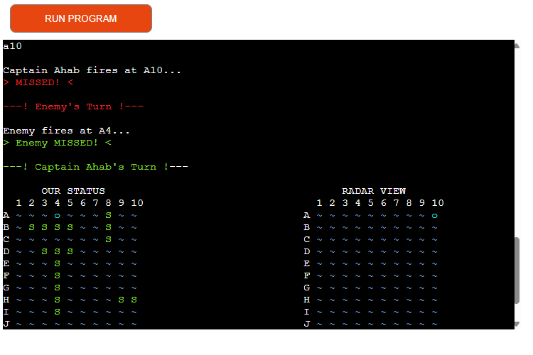

* A successful hit is indicated by an "x".
    * Additionally, a message is displayed for both hits and misses, which are indicated by green or red colours.

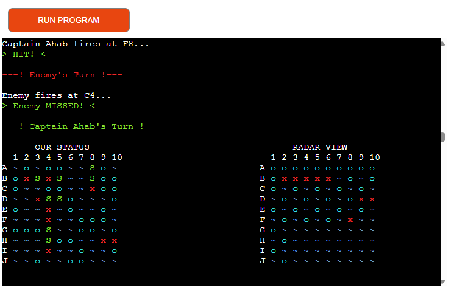

* If the user sinks a ship belonging to the computer, a corresponding message will be displayed.

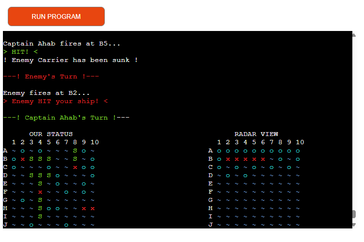

* A clear message is also displayed if the computer sinks one of the user's ships.

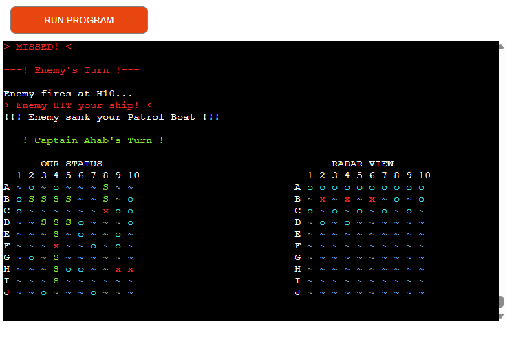

### **Game Over**

* The game ends when either the player or the computer has sunk all of the opponent's ships.
* A clear message indicating whether the outcome was a win or a loss is then issued.

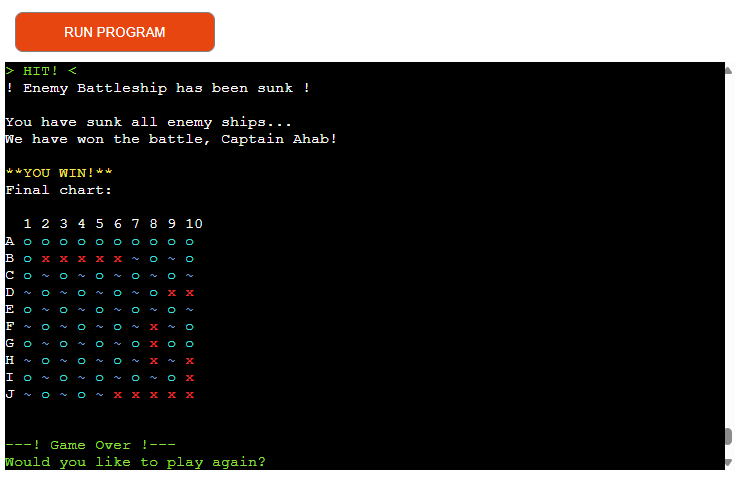

* A "Game Over" message is then displayed and the start screen is loaded.
* Now the user can start the game again or quit the game.

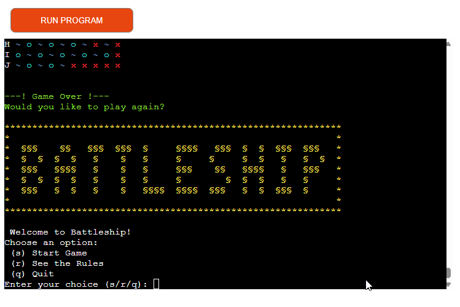

***
## **Future Improvements**
While the current version provides a comprehensive Battleship experience, some potential features were postponed due to the project's limited timeframe.
Future updates could include the following:
* Advanced computer AI: Implement a "smarter" AI for the computer that will "hunt" for the rest of the ship by targeting adjacent squares after scoring a hit.
* Variable board sizes: Allow players to select different grid dimensions.
* Customisable fleet: You can select different ship types or quantities.
* Sound effects: Basic sound cues for hits, misses and sinking ships. This would require either a library capable of producing sound in the terminal, or a transition to a GUI.
* Persistent high scores: What if a scoring system were added?

***
## **Testing Phase**
I have documented the testing processes, both during and after development, in a separate file named [TESTING.md](TESTING.md).

***
## **Libraries**
This project utilizes Python's built-in standard libraries:
* random: Used for:
    * Random placement of the computer's ships.
    * Random placement of the player's ships if selected.
    * Random shot selection by the computer opponent.

* time: Used for:
    * Implementing time.sleep() to create timed pauses in the game flow, enhancing readability and user experience by giving the player time to process on-screen messages and board updates.

***
## **Deployment**
This project was developed using VS Code, github and heroku.
* VS Code was used as the local development environment, with the project's corresponding GitHub repository being linked to it.
* GitHub was used for version control and was linked to Heroku to enable automatic deployment whenever updates were made to the main branch.
* The game was deployed via Heroku. It can be accessed via the following link: https://msp3-battleship-a0f0482c2f33.herokuapp.com/
* The application is designed to run in a terminal environment. It is launched using the run.py script.

Follow this step-by-step guide to play it locally:

* Access the repository via https://github.com/ksstrat/milestone-project-3
* Get the HTTPS URL by clicking the green "<> Code" button and copy it.
* Open a terminal in your IDE, type "git clone" and past in the URL of the repository after it. Then press enter.
* You have successfully cloned the repository to your system.
* Before running the program, ensure that you have installed all the requirements listed in the 'requirements.txt' file.

***
## **Credits**
* I would like to thank my mentor, Richard Wells, for his guidance and support.
* The project drew inspiration from the Code Institute's Portfolio 3 Assessment Guide and Project Scope Video.
* The design is inspired by Hasbro's Battleships board game.
* Throuhout the project, i used python 3.13.3 documentation and w3schools as primary resources for guidance and reference.
* The YouTube channels [freecodecamp.org](https://www.youtube.com/watch?v=Ej_02ICOIgs) and [Corey Schafer](https://www.youtube.com/watch?v=ZDa-Z5JzLYM) provided me with an excellent introduction to object-oriented programming and served as a useful reference.

